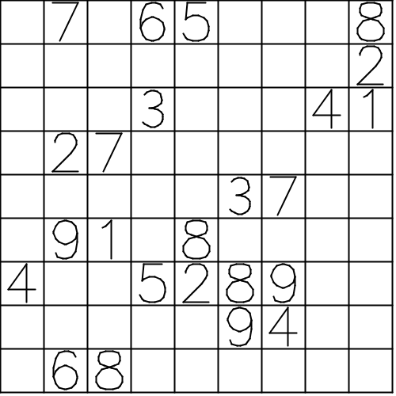

# SudokuGcode

A Processing 3 programm that generates gcode to draw a sudoku. The Sudoku is generated with the Sudoku Lib by sfuhrm. 
Can be run standalone however it is created to be a module for [Depictor](https://github.com/Iqwertz/Depictor) - therefore no gui. 

The svg can be generated with the solution by setting generateSvgSolution to true. 

Generated files are in the "output" folder.

Following files are generated:
- output/gcode.nc
- output/image.svg
- output/preview.png

The Sudoku is generated with [sfuhrm/sudoku](https://github.com/sfuhrm/sudoku).

